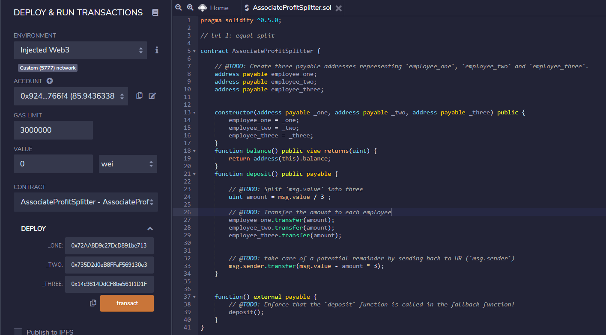
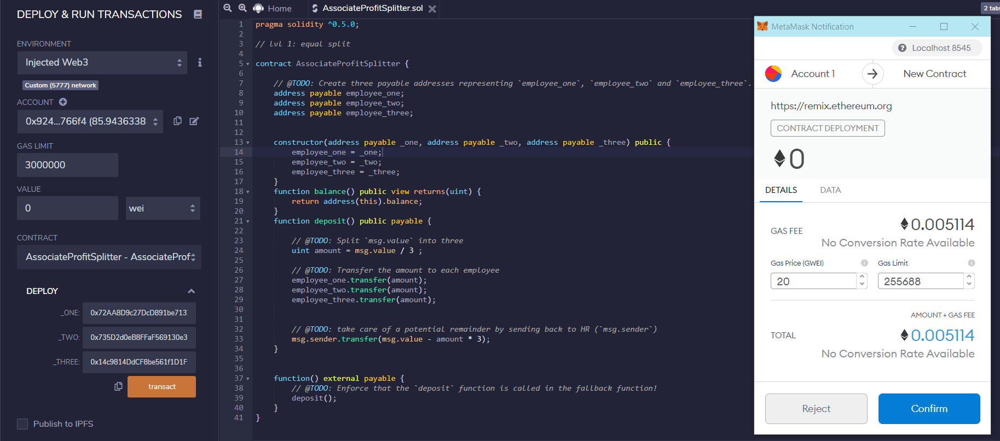
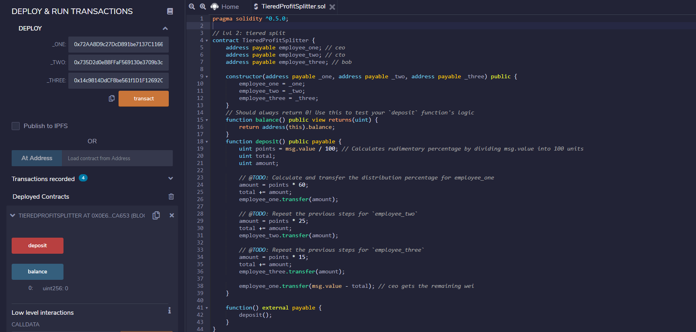
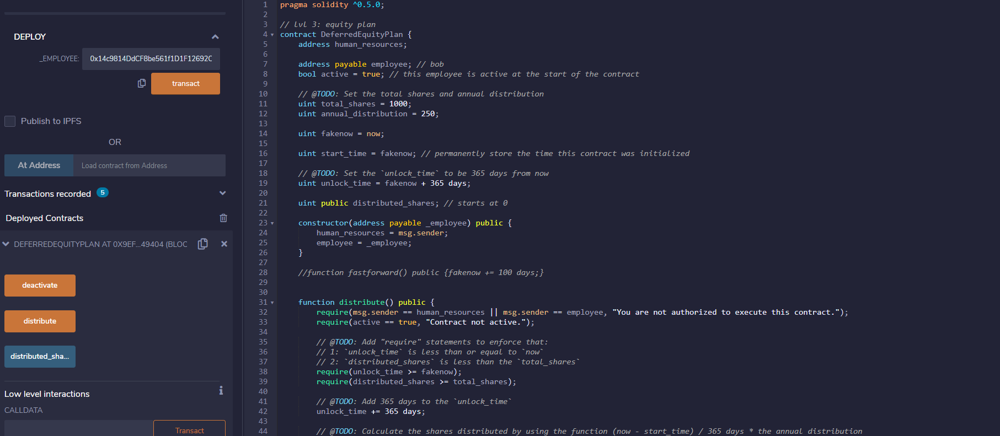

# Smart_Contracts_Solidity
# Hamza Mhadi 
# May 2021 

Level One Contract: Associate Profit Splitter
-Smart Contract used to equally disburse payments to employees from HR

-Only employee account numbers need to be entered.
-The deposit function will divide the amount equally and the residual will be sent back to HR. 
 

Level Two Contract: Tiered Profit Splitter 
-Helps disbursed payments based on different tieres within the organization 
-Prior to deploying contract, only employee account numbers will be entered, which contain respective % 

 

Level Three Contract: Deferred Equity 
-Used for stock disbursments over 4 years 

-
